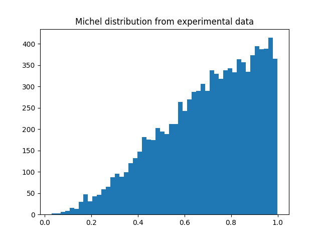
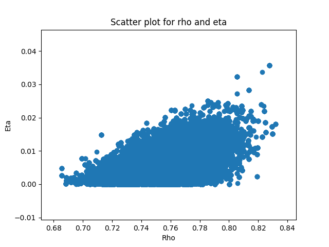
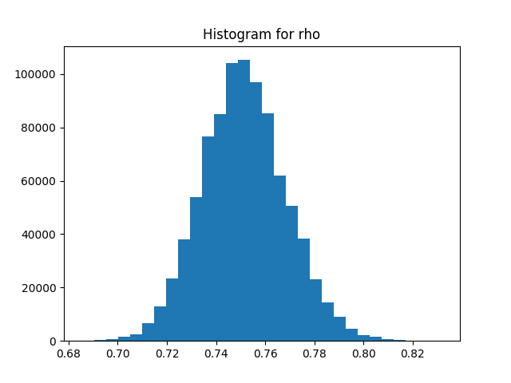
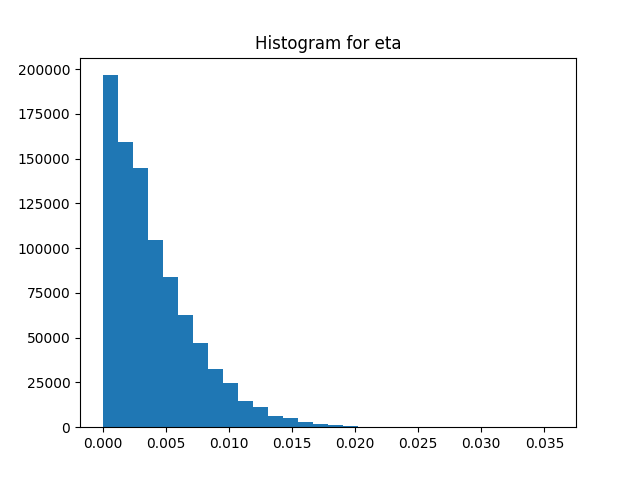

# Jacob Windsor - Bayesian Statistics Exam 2019/2020

This is a compiled document containing the code and output. All files can be found at [https://github.com/jacobwindsor/BIST_SDA_BAYESIAN](https://github.com/jacobwindsor/BIST_SDA_BAYESIAN)

## Code
```python
import pandas as pd
import matplotlib.pyplot as plt
import statsmodels.api as sm
import scipy.stats as stats
import numpy as np
from pathlib import Path
import math
import pymc3 as pm
from statsmodels.stats.multicomp import MultiComparison
from statsmodels.sandbox.stats.multicomp import tukeyhsd 
from statsmodels.graphics.factorplots import interaction_plot
from functools import partial

# Ex 1
x_data = np.loadtxt(Path.cwd() / "michel.out")
plt.hist(x_data, bins=50)
plt.title("Michel distribution from experimental data")
figpath = Path.cwd() / "histogram.png"
print(f"Histogram saved to {figpath}")
plt.savefig(figpath) 

# Ex 2

def michel_equation(n, p, x):
    part_1 = (4 / (1+(2*n)))
    part_2_a = (3*(x**2))*(1-x)
    part_2_b = (2/3)*(p*(x**2))*((4*x)-3)
    part_2_c = (3*n*x)*(1-x)

    return part_1 * (part_2_a + part_2_b + part_2_c)

def log_posterior(n, p):
    if n < 0:
        return -np.inf

    return np.sum(
        np.log(
            michel_equation(n, p, x_data)
        )
    )    


# Ex 3-4
smu_1 = 0.08
smu_2 = 0.05

def proposal(n, p):
    p_n = np.random.normal(n, smu_1)
    p_p = np.random.normal(p, smu_2)

    return (p_n, p_p)
NC = 10**6
NB = 10**5
chain = np.empty((NC, 3))

# Set initial n and p
init_n = 0.4
init_p = 0.1

chain[0] = init_n, init_p, log_posterior(init_n, init_p)

for i in range(0, NC-1):
    prop = proposal(chain[i,0], chain[i,1])    
    log_post_1 = log_posterior(*prop)
    log_ratio = log_post_1 - chain[i,2]

    if (log_ratio >= 0) or (log_ratio > np.log(np.random.random())):
        chain[i+1] = prop[0], prop[1], log_post_1
    else:
        chain[i+1] = chain[i]

chain = chain[NB:]
sample_ns = chain[:,0]
sample_ps = chain[:,1]

predicted_p = np.mean(sample_ps)
predicted_n = np.mean(sample_ns)

n_sd = np.std(sample_ns)
p_sd = np.std(sample_ps)


# Ex 5
print(f"Sample mean of n: {predicted_n}")
print(f"Sample mean of p {predicted_p}")

print(f"Sample standard deviations of n: {n_sd}")
print(f"Sample standard deviations of p: {p_sd}")

print(f"Correlation coefficient: {np.corrcoef(sample_ps, sample_ns)[0,1]}")

plt.figure()
plt.scatter(sample_ps, sample_ns)
plt.title("Scatter plot for rho and eta")
plt.xlabel("Rho")
plt.ylabel("Eta")
plt.savefig("scatter.png")

plt.figure()
plt.hist(sample_ps, bins=30)
plt.title("Histogram for rho")
plt.savefig("rho_hist.png")

plt.figure()
plt.hist(sample_ns, bins=30)
plt.title("Histogram for eta")
plt.savefig("eta_hist.png")

predicted_p = np.mean(sample_ps)
predicted_n = np.mean(sample_ns)

n_confirmed = predicted_n <= n_sd and predicted_n >= -n_sd
n_text = "confirms" if n_confirmed else "does not confirm"
print(f"The predicted value for eta {n_text} the validity of the standard model.")


p_confirmed = predicted_p <= 0.75 + p_sd and predicted_p >= 0.75 - p_sd
p_text = "confirms" if p_confirmed else "does not confirm"
print(f"The predicted value for eta {p_text} the validity of the standard model.")
```

## Output
```
Sample mean of n: 0.004007007506613073
Sample mean of p 0.7514255564516957

Sample standard deviations of n: 0.0033920588170428707
Sample standard deviations of p: 0.017209825117467537

Correlation coefficient: 0.47958948423117254

The predicted value for eta does not confirm the validity of the standard model.
The predicted value for rho confirms the validity of the standard model.
```
### Histogram of input data


### Scatter plot of inferred rho and eta


### Histogram of inferred rho values


### Histogram of inferred eta values
